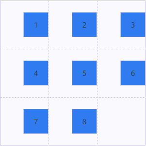

### grid
  网格布局，一种二维布局系统，将网页划分成一个个的网格进行布局。

##### 基本概念
  1. *容器*：采用网格布局的元素，称为容器（grid container） display: grid | inline-grid;
  2. *项目*：容器的顶层子元素，不包含项目的子元素;
  3. *行&列*：容器中的水平区域称为行（row），垂直区域称为列（column）;
  4. *单元格*：行和列的交叉区域，称为单元格（grid cell）;
  5. *网格线*：划分网格的线，水平网格线划分行，垂直网格线划分列；
  6. *网格区域*：由网格线包围形成的区域（grid area），一个网格区域可以由任意的单元格组成。

##### 容器属性
  ###### display: grid | inline-grid
  ---
  设置元素为网格布局，inline-grid为行内元素的网格布局。  

  ###### grid-template-columns/grid-template-rows
  ---
  将元素设置为网格布局之后，就需要对容器进行划分行和列。grid-template-columns设置列宽，grid-template-rows设置行高。 
  1. **length**可以是固定宽度，也可以是百分比等其他宽度单位。 
    

  
1

  
2

  
3

  
4

  
5

  
6

  
7

  
8

  
9

 

  2. **auto**，自适应，即由浏览器决定宽度。 

    

  上面代码中，第三列的列宽为auto，即自适应容器剩余大小。
    

  
1

  
2

  
3

  
4

  
5

  
6

  
7

  
8

  
9

 

  3. **minmax(min, max)**，定义大小范围的函数，>= min && <= max 
    上面代码中，第三列的列宽返回在200px-400px范围内。
    

  
1

  
2

  
3

  
4

  
5

  
6

  
7

  
8

  
9

 

  4. **repeat(number | auto-fill | auto-fit, trick-list)**，重复值函数，接受两个参数，第一个参数是重复的次数，第二个参数是需要重复的值。 

    

  上面代码中，通过repeat函数，创建了4列3行的网格布局，1、3列和2、4列的列宽分别100px和150px。

  

  
1

  
2

  
3

  
4

  
5

  
6

  
7

  
8

  
9

  
10

  
11

  
12

 

  5. **auto-fill** 关键字，自适应填充，当单元格的大小固定，但容器的大小不确定时，auto-fill可以时每列/每行尽可能的容纳更多的单元格。
  
    

  上面代码表示，每两列的宽度为100px、150px，填充到容器不能再容纳更多的列，试试伸缩网页的宽度。

  
1

  
2

  
3

  
4

  
5

  
6

  
7

  
8

  
9

  
10

  
11

  
12

 

  6. **fr**关键字，fraction（片段）的缩写，用于表示比例关系，如果存在两列的宽度为1fr和2fr，则表示后一列是前一列列宽的两倍。 

    

  上面代码生成了3列2行的网格布局，第一列列宽100px，第二列和第三列则根据1:2的比例，分摊容器剩余大小。

  

  
1

  
2

  
3

  
4

  
5

  
6

 

  7. 网格线名称，使用方括号，命名每一根网格线。 

    

  上面代码中，定义了3列2行的网格布局，一共有4根垂直网格线，3根水平网格线。

  ###### grid-row-gap/grid-column-gap/grid-gap
  ---
grid-row-gap设置行与行间的间隔，grid-column-gap设置列之间的间隔。 
grid-gap: grid-row-gap | grid-column-gap，为两者的简写形式，省略第二个值时，默认第二个值等于第一个值。

    

上述代码创建了3列2行的网格布局，列间隔30px，行间隔为20px。

  
1

  
2

  
3

  
4

  
5

  
6

 
 

  ###### grid-template-areas
  ---
  对网格区域命名。每一个字符串会对应一行，一个字符串中用空格分割的单元格生成一列，多个同名且跨越相邻行或列的单元格称为网格区块。非矩形的网格块无效。一个点号（.）表示一个空单元格。 
  注：被命名的网格区域（grid areas）会自动生成隐式的被命名的基线

    

  上面代码中，创建了3行3列的网格布局，又对网格进行了命名，划分为header、sider、main、footer四个区域，同时需要对项目指定区域，效果图如下。

  
header

  
sider

  
main

  
footer

  ###### grid-auto-flow
  ---
  grid-auto-flow: *row* | *column* | *row dense* | *column dense* 
  控制自动布局算法，设置元素排列方式。默认值为row。dense 指定布局算法尽量去填充网格中之前的空白区域，但会导致出现的顺序会被打乱。

    

  上面代码中，创建了3列3行的网格，又指定了第一个和第二个项目跨越两个单元格。根据自动布局算法，项目会按照顺序依次显示。

  
1

  
2

  
3

  
4

  
5

  
6

  
7

  
8

  
9

 

    grid-auto-flow: row dense

  设置布局算法为row dense，按行排列，且尽可能的填满前面的空白区域。

  
1

  
2

  
3

  
4

  
5

  
6

  
7

  
8

  
9

 

  ###### grid-auto-rows/grid-auto-columns
  ---
  grid-auto-rows/grid-auto-columns: *length* | *percentage* | *auto* | *minmax(min, max)* | *fr* 
  设置任何自动生成的网格轨道（grid tracks）（隐式网格轨道）的大小。 

    

  
1

  
2

  
3

  
4

  
5

  
6

  
7

  
8

 

  ###### justify-items/align-items/place-items
  ---
  justify-items/align-items: *start* | *center* | *end* | *stretch*; 
  place-items: align-items justify-content 
  justify-items设置单元格内容的水平位置，align-items设置单元格内容的垂直位置，place-items为两者的简写属性。 

    

  上面代码中，创建了3列3行的网格布局，并设置单元格内容水平向右对齐，垂直居中对齐，效果如下：

  

    

      
1

    

    

      
2

    

    

      
3

    

    

      
4

    

    

      
5

    

    

      
6

    

    

      
7

    

    

      
8

    

  

  

 
 
  
  ###### justify-content/align-content/place-content
  ---
  justify-content/align-content: *start* | *center* | *end* | *stretch* | *space-around（每个项目的左右/上下边距都相同）* | *space-between（两端对齐，多余空间均匀分布）* | *space-evenly（多余空间均匀分布）* 
  place-content: align-content justify-content 
  justify-content设置整个内容区域在容器中的水平位置，而align-content则是设置垂直位置，place-content是两者的缩写属性。

    

  上面代码中，生成2行3列的网格布局，并且每个单元格都均分了剩余的空间，效果如下：

  
1

  
2

  
3

  
4

  
5

  
6

 
 

  ###### grid
  ---
  网格容器属性的简写属性。 
  grid:
  - *grid-template*
  - *grid-template-rows / [ auto-flow && dense? ] <'grid-auto-columns'>?*
  - *[ auto-flow && dense? ] <'grid-auto-rows'>? / <'grid-template-columns'>*

##### 项目属性

  ###### grid-column-start/grid-column-end/grid-column
  ---
  grid-column-start/grid-column-end: *auto* | *integer（不为0）* | *custom-ident* | *span && [ positive integer | custom-ident ]（integer省略时，默认为1）* 
  grid-column: grid-column-start / grid-column-end 
  设置网格项目的开始/结束的垂直网格线。

    

  上面代码表示，创建了2行3列的网格布局，同时指定第一个项目的列，垂直开始轴线为第一根，跨越了两个单元格，效果如下：

  
1

  
2

  
3

  
4

  
5

  ###### grid-row-start/grid-row-end/grid-row
  ---
  grid-row-start/grid-column-end: *auto* | *integer（不为0）* | *custom-ident* | *span && [ positive integer | custom-ident ]（integer省略时，默认为1）* 
  grid-row: grid-row-start / grid-row-end 
  设置网格项目的开始/结束的水平网格线。

    

  上面代码中，生成了3行3列的网格布局，对每根轴线都进行了命名。指定了第一个项目的水平开始周轴线为第一根，同时跨越单元格到水平轴线r3，即第三根水平轴线，效果如下：

  
1

  
2

  
3

  
4

  
5

  
6

  
7

  
8

  ###### grid-area
  ---
  grid-area: *row-start / column-start / row-end / column-end* | *custom-ident* 
  grid-row-start、grid-column-start、grid-row-end、grid-column-end的缩写属性，属性值可以是1到4条grid-line，也可以直接指定区域。 
  指定网格项目的大小和位置 

    

  上面代码的效果如下。

  
1

  
2

  
3

  
4

  
5

 
 

  ###### justify-self/align-self/place-self
  ---
  justify-self/align-self: *start* | *center* | *end* | *stretch* 
  place-self: align-self justify-self 
  justify-self设置单个项目在容器中的水平位置，align-self则设置垂直位置。 

    

  上面代码中，设置第一个项目，水平右对齐，垂直居中。

  
1

  
2

  
3

  
4

  
5

  
6

