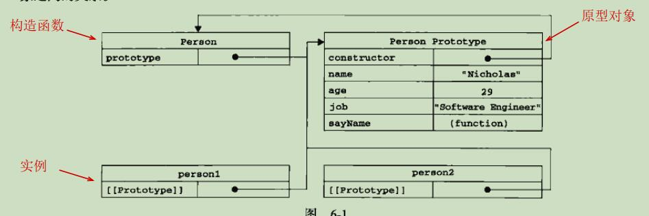

### JavaScript中创建对象的几种模式

1. 工厂模式
```
function createPerson(name, age) {
  var o = new Object()
  o.name = name
  o.age = age
  
  o.sayName = function() {
    alert(this.name)
  }
  
  return o
}

var p1 = createPerson('Jack', 20,)
p1.sayName()
```

优点：解决了创建重复对象的问题
缺点：不能判断对象的类型

2. 构造函数模式
```
function Person(name, age) {
  this.name = name
  this.age = age
  this.sayName = function() {
    alert(this.name)
  }
}

var p1 = new Person('Jack', 20,)
p1.sayName()
console.log(p1 instanceof Person) // true p1是Person的实例
console.log(p1 instanceof Object) // true p1是Object的实例
console.log(p1.constructor === Person)  // true p1的构造函数是Person函数

通过new 调用构造函数的4步骤
1. 创建一个新对象
2. 将当前作用域赋值给新对象，即this指向新对象
3. 执行构造函数，即给新对象添加属性和方法
4. 返回新对象
```

优点：通过构造函数，确定对象类型
缺点：创建实例时，方法会被重复创建

3. 原型模式
```
function Person() {}

Person.prototype.name = 'Jack'
Person.prototype.age = 20
Person.prototype.hobby = ['singing', 'football']
Person.prototype.sayName = function() {
  alert(this.name)
}

var p1 = new Person()
p1.sayName()

var p2 = new Person()
p2.name = 'rose'
p2.hobby.push('basketball')
console.log(p2.hobby) // ["singing", "football", "basketball"]
console.log(p1.hobby) // ["singing", "football", "basketball"]

```
原理：
1. 创建函数后，函数都会有prototype属性，指向函数的原型对象
2. 原型对象存放了原型是所有属性和方法
3. 函数的原型对象存在constructor属性，指向构造函数，本例中，Person.prototype.constructor === Person
4. 通过调用构造函数创建实例后，实例内部包含指针[[Prototype]]（部分浏览器通过__proto__进行访问），指向构造函数的原型对象



优点：解决了重复创建方法的问题
缺点：属性也会被实例共享

4. 组合使用构造函数模式和原型模式
```
function Person(name, age) {
  this.name = name
  this.age = age
  this.hobby = ['singing', 'football']
}
Person.prototype.sayName = function() {
  alert(this.name)
}

var p1 = new Person('Jack', 20)
p1.sayName()
p1.hobby.push('basketball')
console.log(p1.hobby) // ["singing", "football", "basketball"]

var p2= new Person('Rose', 20)
console.log(p2.hobby) // ["singing", "football"]


console.log(p1 instanceof Person) // true p1是Person的实例
console.log(p1 instanceof Object) // true p1是Object的实例
console.log(p1.constructor === Person)  // true p1的构造函数是Person函数

```
优点：通过构造函数实例化属性，通过原型链共享方法