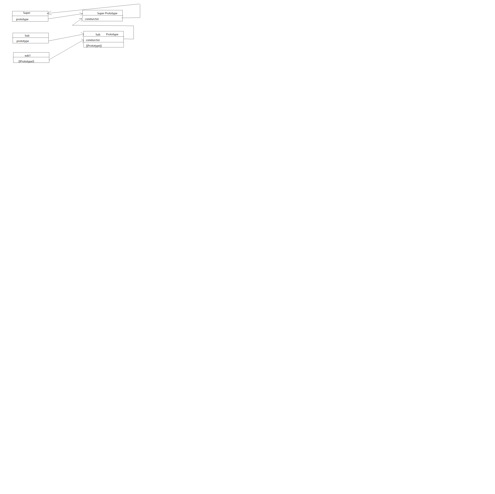

### ECMAScript 继承
  ECMAScript只支持实现继承，且是依靠原型链来实现的。 <br>
  基本思想：利用原型，让一个引用类型去继承另一个引用类型的属性和方法，即重写原型对象。

1. 原型链
  构造函数、原型和实例的关系：
    构造函数存在一个指向原型对象的指针(prototype)；原型对象存在一个指向构造函数的指针(constructor)；实例存在一个指向原型对象的指针(\[\[prototype\]\])
  <br>

  将一个原型对象，等于另一个类型的实例时，当前的原型对象将包含一个指向另一个原型对象的指针，而另一个原型对象也包含着指向另一个构造函数的指针。如果另一个原型对象又是另一个类型的实例，则上述关系依旧成立，如此层层递进，就构成了实例与原型的链条，即原型链。
  <br>

  基本代码：
```
  function Super() {}

  function Sub() {}

  // 继承Super
  // Sub的原型对象，是Super类型的实例，所以Sub的原型对象存在指针([[Prototype]])，指向Super的原型对象
  Sub.prototype = new Super()

  let sub1 = new Sub()

  // 此时sub1.prototype.construcor是Super
  Sub.prototype.constructor === Super // true
```


2. 确定原型和实例的关系

  1. instanceof instanceof constructor<br>
    检测构造函数的原型是否出现在实例对象的原型链中
```
  sub1 instanceof Super //  true
```
    

  2. Object.prototype.isPrototypeOf(object)<br>
    检测一个对象是否存在另一个对象的原型链上
```
  Super.prototype.isPrototypeOf(sub1) // true
```

  3. isPrototypeOf成立，则instanceof一定成立


3. 原型链的问题
  1. 引用类型的属性问题，会被实例共享
```
  function Super() {
    this.nums = [1, 2, 3]
  }

  function Sub() {}

  // 继承Super
  // 此时Sub的实例中的nums，都引用自此时的实例
  Sub.prototype = new Super()

  let sub1 = new Sub()
  sub1.nums.push(4)
  console.log(sub1.nums)  // [1,2,3,4]

  let sub2 = new Sub()
  console.log(sub2.nums)  // [1,2,3,4]

```

  2. 无法向父类构造函数传参