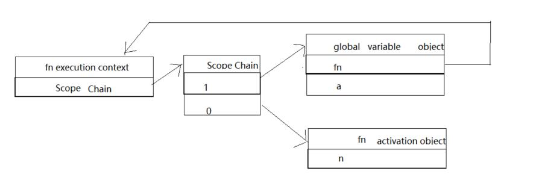
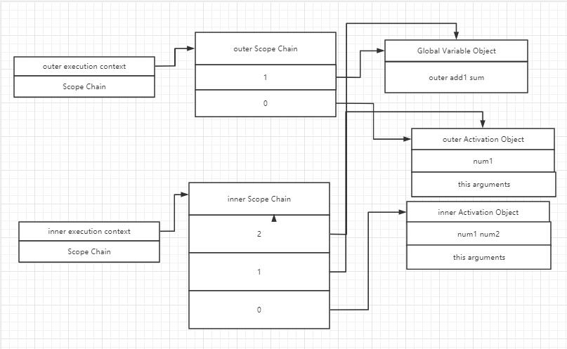

### 闭包

##### 1. 概念：指有权访问另一个函数作用域中的变量的函数。

##### 2. 作用域链

  当函数被调用时，会创建一个执行环境（execution context）及相应的作用域链，并把作用域链赋值给一个特殊的内部属性\[\[Scope\]\]。
再使用this、arguments和其它命名参数的值，来初始化函数的活动对象（activation object）。
但在作用域链中，该函数外部的活动对象位于作用域链的第二位，直至作为作用域链终点的全局执行环境。

```
functin fn(n) {
  return n + 1
}

var a = fn(1)
```
下图即为上方代码的作用域链示意图。


  作用域链本质是一个指向变量对象的指针列表。一般情况下，当函数执行完毕后，局部活动对象就会被销毁，内存中仅保存全局作用域。
  在一个函数内部定义的函数，会将外部函数的活动对象添加到定义函数的作用域中。当内部函数被返回时，其作用域链会包含外部函数的
  活动对象和全局变量对象。即使外部函数执行完毕后，相应的作用域链会被销毁，但其活动对象不会被销毁，因为内部函数还保持着对外
  部函数活动对象的引用，直至内部函数被销毁。
  ```
  function outer(num1) {
    return function inner(num2) {
      return num1 + num2
    }
  }

  var add1 = outer(1)

  var sum = add1(2)
  ```


##### 3. 闭包与变量
```
var result = []
for(var i = 0; i < 10; i++) {
  result.push(function() {
    alert(i)
  })
}

result[1]() // 10


var result = []
for(var i = 0; i < 10; i++) {
  result.push(function(num) {
    return function() {
      alert(num)
    }
  }(i))
}
result[1]() // 1
```

##### 4. 内存泄露（memory leak）**闭包本身不会造成内存泄露**

概念（百度百科）：程序中已动态分配的堆内存，由于某种原因程序未释放或无法释放，造成系统内存的浪费，导致程序运行速度减慢甚至系统崩溃。
即没有用到的内存，没有及时释放。<br>

可能引起内存泄露的问题：

  1. 定时器：setInterval必须使用clearInterval去清除

  2. 对BOM/DOM对象的应用：
    Jquery中on绑定事件时，没有先off，导致多次绑定事件；<br>
    对象中保持着对BOM/DOM的引用等；<br>
    使用第三方插件，没有及时销毁<br>

##### 5. 模仿块级作用域
```
(function() {
  // 块级作用域
})()
```

参考：
  [常见的JavaScript内存泄露](https://www.cnblogs.com/woniubushinide/p/8024051.html)
  [js造成内存泄漏的几种情况](https://www.cnblogs.com/xiaocuncheng/p/11101698.html)
  [避免内存泄漏](https://cn.vuejs.org/v2/cookbook/avoiding-memory-leaks.html)